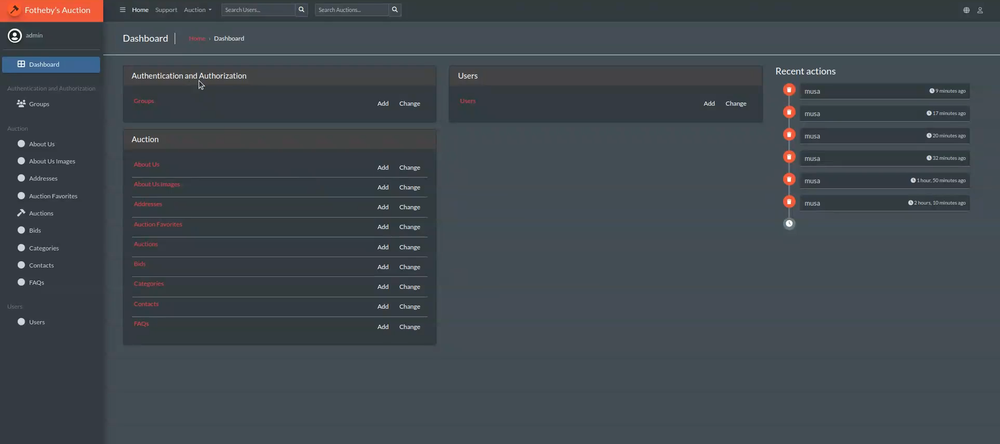

***
# Zokirjonova Muslima 24835737
***
## Project Overview

This project is developed using Python and Django Rest Framework. It includes various functionalities such as database migrations, static file collection, and user management.

## Project Auction

The Auction Management System allows users to create, view, and bid on auctions. It includes features for managing auction details, bidding history, and user authentication.

## Setup Instructions

### Requirements

- Python
- pip

### Installation

1. Install the required packages:
    ```sh
    pip3 install -r requirements.txt
    ```

2. Apply database migrations:
    ```sh
    ./manage.py makemigrations
    ./manage.py migrate
    ```

3. Create a superuser:
    ```sh
    python3 manage.py createsuperuser --username admin --email admin@mail.com
    ```

4. Collect static files:
    ```sh
    python3 manage.py collectstatic
    ```

## Usage

- To start the development server:
    ```sh
    python3 manage.py runserver
    ```

## API Endpoints Example

- `POST /api/v1/auction/bid`: Place a bid on an auction.
- `GET /api/v1/auction/<auction_id>`: Retrieve auction details.
- `GET /api/v1/auctions`: List all auctions.
- `GET /api/v1/auctions/search`: Search auctions by name.
- `GET /api/v1/auctions/top`: List top auctions.
- `GET /api/v1/auctions/best-artist`: Get the artist with the highest number of auctions.

## Additional Information

### Database Models

The project includes several database models such as `Auction`, `Bid`, `User`, `Category`, and more. These models are used to store and manage data related to auctions, bids, users, and categories.

### Serializers

The project uses Django Rest Framework serializers to convert complex data types, such as querysets and model instances, into native Python datatypes that can then be easily rendered into JSON, XML, or other content types.

### Views

The project includes various views to handle different API endpoints. These views are responsible for processing incoming requests, performing operations on the data, and returning appropriate responses.

### Permissions

The project uses Django Rest Framework's permission classes to control access to different parts of the application. For example, only authenticated users can place bids on auctions.

### Error Handling

The project includes error handling mechanisms to ensure that appropriate error messages are returned when something goes wrong. For example, if a user tries to place a bid on an auction that does not exist or has ended, an error message is returned.

### Testing

The project includes unit tests to ensure that the different parts of the application work as expected. These tests can be run using the following command:
```sh
pytest auction/tests/test_views.py
pytest auction/tests/test_models.py
```


# Author

Zokirjonova Muslima 24835737
***


## Project Overview

This project is developed using Python and Django Rest Framework. It includes various functionalities such as database migrations, static file collection, and user management.

### Admin Panel

The Admin Panel allows users to manage auctions, bids, users, and categories. It includes features for creating, updating, and deleting records.

***



***


